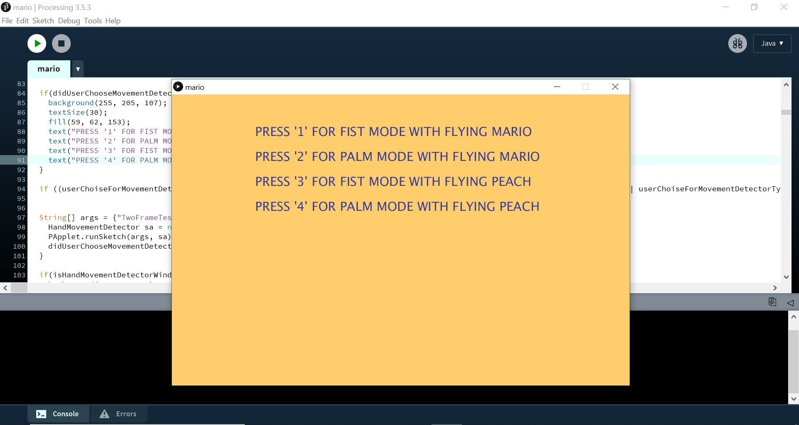
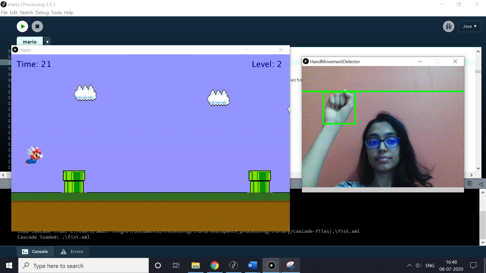
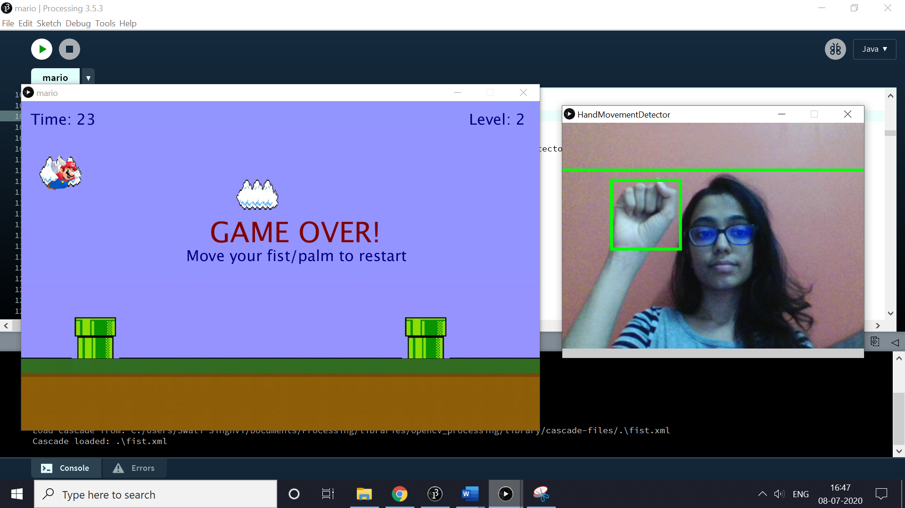

# Gesture Recognition with Flying Mario/Peach
Use gestures to play the famous game of flying Mario. Includes features such as choosing the game mode and character

To run the file

1. Go to 'Processing\processing-3.5.3' and open the processing application

2. Click on Tools -> Add Tool -> Libraries

3. Type and Install the libraries 'Video 1.0.1 |  GStreamer-based video library for Processing' and 'OpenCV for Processing 0.5.4 | Computer vision with OpenCV'

4. Once done, go to 'HCI\human_computer_interaction-master\human_computer_interaction-master\src\mario\mario' and copy the files fist.xml and palm.xml

5. Then, go to Documents folder on your system and open the Processing folder. Then go to libraries\opencv_processing\library\cascade-files and paste the two xml files copied earlier

6. Go back to the processing application. Click on File -> Open and go to 'HCI\human_computer_interaction-master\human_computer_interaction-master\src\mario\mario'. Open the file mario.pde and execute it

# Menu

# Flying Mario using Fist mode

# Game Over 

